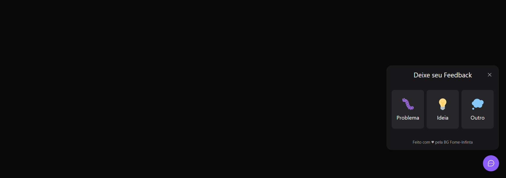

<h1 align="center">
    
</h1>

<h4 align="center"> 

 	  Site Concluído!! 	

</h4>

<p align="center">
 <a href="#-sobre-o-projeto">Sobre</a> •
 <a href="#-funcionalidades">Funcionalidades</a> •
 <a href="#-layout">Layout</a> • 
 <a href="#-como-executar-o-projeto">Como executar o site</a> • 
 <a href="#-tecnologias">Tecnologias</a> • 
 <a href="#-autor">Autor</a> • 
 <a href="#user-content--licença">Licença</a>
</p>

## 💻 Sobre o projeto
Esse é um projeto pessoal que eu desenvolvi para ser uma forma dos clientes de uma hamburgueria deixarem um feedback para os donos, podendo reclamar de algo que não gostaram, deixarem ideias de futuros produtos, hamburguers..., ou outros. Também podem enviar uma screenshot da tela pra mostrar o problema que está acontecendo.
O projeto da hamburgueria ainda esta sendo desenvolvido, mas esse vai ser veinculado a ele.


Esse projeto foi inteiro desenvolvido durante o **NLW - Next Level Week Return** oferecida pela [Rocketseat](https://blog.rocketseat.com.br/primeira-next-level-week/).

O NLW é uma experiência online com muito conteúdo prático, desafios e hacks onde o conteúdo fica disponível durante uma semana.


## Observação 
O Back-and ainda vai ser desenvolvido junto com o projeto em React Native 

---

## ⚙️ Funcionalidades

- [x] clientes tem acesso a um botão
- [x] nele vai escolher as opções entre, problema, ideia, outros
- [x] vai poder relatar o acontecido 
- [x] vai poder tirar um print do acontecido
- [x] vai poder enviar o print e a mensagem
- [x] acesso em tablets, celulares e notebook de forma responsiva

---

## 🎨 Layout

### Mobile

<p align="center">
  

  


</p>

---

### Web

<p align="center" style="display: flex; align-items: flex-start; justify-content: center;">
  

  

  
</p>

---

## 🚀 Como executar o projeto/site

basta acessar o o link
[bg-fome-infinita](https://bg-fome-infinita-nm90bb7vj-deyvisontav.vercel.ap)

#### 🧭 Rodando a aplicação web (Frontend)

```bash

# Clone este repositório
$ git clone git@github.com:DeyvisonTav/BG-fomeInfinita.git

# Acesse a pasta do projeto no seu terminal/cmd
$ cd FAQ-Burguer

# Instale as dependências
$ npm install

# Execute a aplicação em modo de desenvolvimento
$ npm run dev

# A aplicação será aberta na porta:3000 - acesse http://localhost:3000

```

---


## 🛠 Tecnologias

As seguintes ferramentas foram usadas na construção do projeto:

#### **Website**/**Mobile** ([Reactjs](https://reactjs.org/docs/hello-world.html/) + [TailwindCss](https://tailwindcss.com/) + [Headless UI](https://headlessui.dev/) + [Typescript](https://www.typescriptlang.org/docs/))

---

## 🦸 Autor

<br/>
<a href="https://github.com/DeyvisonTav">
 
 <br />
 <br/>
 <sub><b>Deyvison Tavares</b></sub>🚀</a>
 <br />
 <br />

[](https://www.linkedin.com/in/deyvison-tavares/)
[](mailto:deyvisontav@gmail.com)

---

## 📝 Licença

Este projeto esta sobe a licença [MIT](./LICENSE).

Feito com ❤️ por Deyvison Tavares 👋🏽 [Entre em contato!](https://www.linkedin.com/in/deyvison-tavares/)
